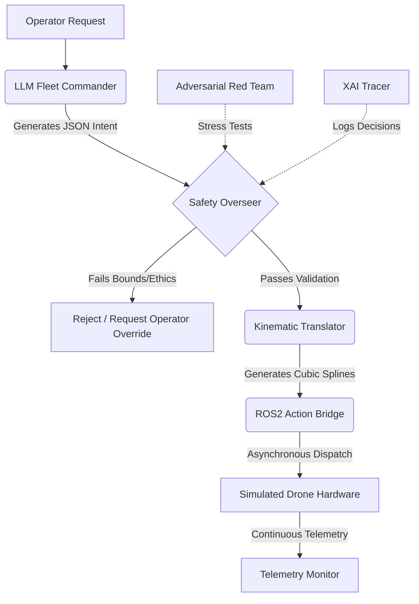

# Autonomous Fleet Orchestrator

[](https://opensource.org/licenses/MIT)
[](https://www.python.org/downloads/)
[](#)

An enterprise-grade, Multi-Agent LLM Orchestration architecture designed for the secure, mathematically verifiable, and aligned management of simulated autonomous delivery fleets.

This system is built from the ground up prioritizing **AI Alignment** and **Safety Verification**, ensuring that probabilistic large language models operating in physical-world abstractions adhere strictly to predefined kinematic limits, ethical constraints, and formal geometric bounds.

## Core Architectural Modules

### 1. Constitutional AI & Safety Overseer (`src/autonomous_fleet_orchestrator/alignment/safety_overseer.py`)
A rigorous Guardrail Agent that intercepts and validates every natural language dispatch request prior to hardware execution.
- **Prompt Injection Defense**: Prevents adversarial inputs aiming to override physical constraints.
- **Geofence Enforcement**: Dynamically enforces geographic exclusion zones.
- **Priority Escalation Control**: Mandates strict human-in-the-loop overrides for requests flagged with critical priority.

### 2. Offensive Alignment & Red Teaming (`src/autonomous_fleet_orchestrator/red_team/`)
An automated adversarial framework that continuously generates synthetic prompt injections, coordinate obfuscations, and boundary stress tests to mathematically guarantee the robustness of the `SafetyOverseer`.

### 3. Reward Modeling & RLHF (`src/autonomous_fleet_orchestrator/alignment/reward_model.py`)
Implements a Bradley-Terry reward model structure to score and rank trajectories, penalizing unsafe behavior heavily while rewarding operational efficiency—a foundational component for Reinforcement Learning from Human Feedback (RLHF).

### 4. Formal Kinematic Verification (`src/autonomous_fleet_orchestrator/core/kinematic_translator.py`)
Utilizes NumPy and SciPy to translate discrete coordinate waypoints into continuous, physically realizable Cubic Spline Trajectories. Integrates formal geometric verification to assert that simulated drones do not violate acceleration thresholds or reachability bounds.

### 5. Explainable AI (XAI) Tracer (`src/autonomous_fleet_orchestrator/alignment/xai_tracer.py`)
Provides deterministic, timestamped Chain-of-Thought reasoning logs for comprehensive auditability and compliance reporting.

## System Architecture



## Quickstart

### Containerized Deployment (Docker Compose)
Deploy the orchestration suite and mock ROS2 interfaces securely via Docker Compose:
```bash
docker-compose up --build
```

### Local Development Environment
```bash
python -m venv venv
source venv/bin/activate
pip install -e .
pytest tests/
```

## Testing & Validation
The architecture features comprehensive Pytest coverage specifically validating the boundary logic of the `SafetyOverseer`, the geometric formalisms within the `KinematicTranslator`, and the mathematical guarantees proven by the automated Red Teaming suite.

```bash
pytest -v tests/
```

## Alignment Philosophy
As the deployment of Large Language Models transitions from text generation to autonomous physical actuation, mathematical alignment and verifiable robustness become the critical bottleneck. This architecture serves as an enterprise-grade proving ground for embedding strict, verifiable safety bounds into opaque LLM decision-making loops.
